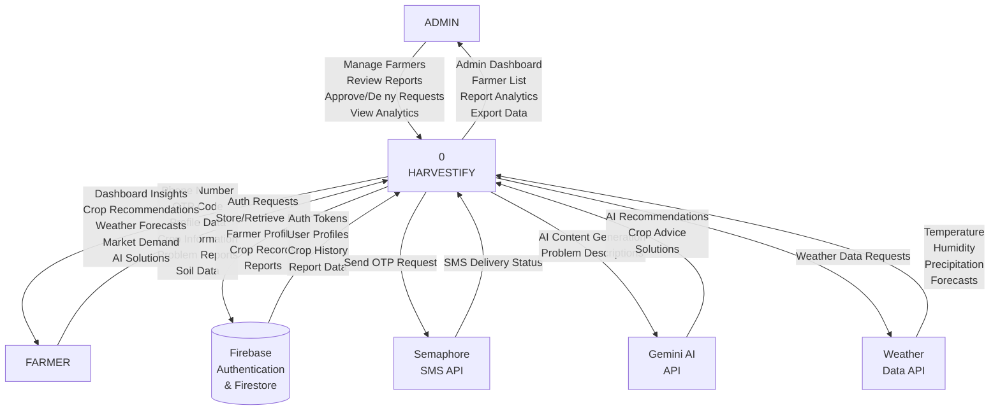
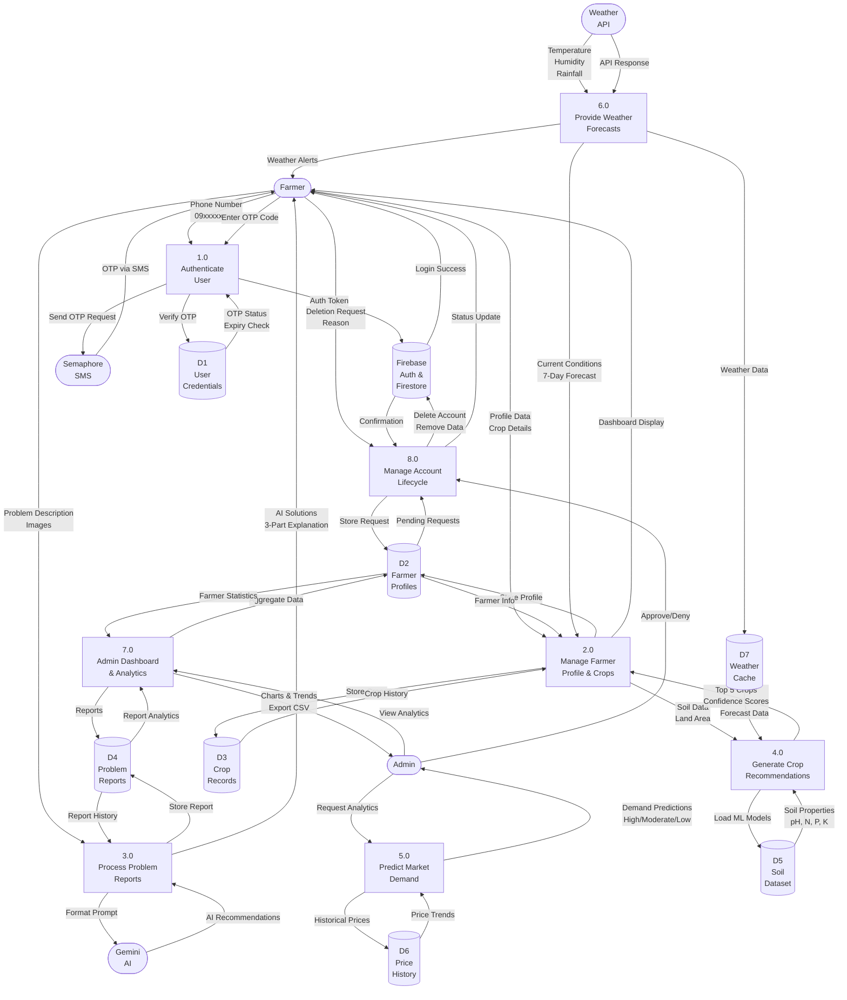

# Harvestify - Majayjay Farm Resource Management System

## Data Flow Diagram & Project Context Diagram

---

## Project Context Diagram

The figure below shows the Project Context Diagram of Harvestify. The figure shows the interaction between the system and the users. Input and outputs within the system are also shown in the figure. Users of the system include the farmer, admin, and external services (Firebase, Semaphore SMS, Gemini AI, and Weather API).



---

## Data Flow Diagram

The figure below shows the data flow of the system. These data are used by the users and processed by the system. Users consists of farmer and admin. Credentials of farmers comes from the Firebase Authentication and OTP codes are sent via Semaphore SMS API.



---

## Mermaid Code for Copy-Paste

Below are the standalone mermaid code blocks you can copy and paste into any mermaid-compatible editor (like [Mermaid Live Editor](https://mermaid.live/), ChatGPT, or Claude):

### 1. Project Context Diagram


### 2. Data Flow Diagram


---

## Academic Prompts for AI-Assisted Diagram Generation

Use these prompts with ChatGPT, Claude, or other AI models to generate alternative versions of the diagrams:

### Prompt 1: Project Context Diagram Generation

```
I need you to generate a professional Project Context Diagram for a smart farming web application called "Harvestify" designed for Majayjay farmers in the Philippines.

SYSTEM DESCRIPTION:
- The system is at the center (labeled "0 HARVESTIFY")
- Frontend: React 18 + TypeScript + Vite + Tailwind CSS (runs on port 5173)
- Backend: FastAPI Python (runs on port 8000)
- Database: Firebase Authentication + Firestore Database
- AI Services: Gemini API for AI-powered crop recommendations
- SMS Service: Semaphore API for mobile OTP authentication
- Weather Service: External weather data API for forecasts

EXTERNAL ENTITIES (rectangles around the system):
1. ADMIN - manages farmers, reviews reports, approves deletion requests, views analytics
2. FARMER - submits login credentials, crop reports, problem reports, soil data; receives dashboard insights, crop recommendations, weather forecasts
3. Firebase Authentication & Firestore - handles authentication, stores user profiles, crop data, reports
4. Semaphore SMS API - sends OTP codes via SMS
5. Gemini AI API - provides AI recommendations for crop problems
6. Weather Data API - provides temperature, humidity, precipitation forecasts

REQUIREMENTS:
- Use flowchart TB orientation (top-to-bottom)
- System box in center labeled "0 HARVESTIFY"
- External entities as rectangles around the system
- Bidirectional arrows between system and each external entity
- Label each arrow with the data flowing (inputs on one side, outputs on the other)
- Make it suitable for a thesis paper at the undergraduate computer science level
- Follow the format shown in academic examples where the system is central with users around it
- Ensure all major data exchanges are shown: authentication, crop management, problem reporting, AI recommendations, weather forecasts, admin analytics, account lifecycle

Please generate the diagram using mermaid syntax with flowchart TB.
```

### Prompt 2: Data Flow Diagram Generation

```
Generate a professional Data Flow Diagram for an agricultural resource management system with the following specifications:

SYSTEM CONTEXT:
Harvestify is a smart farming platform for Majayjay, Philippines farmers that provides AI-powered crop recommendations, mobile OTP authentication, weather forecasts, market demand predictions, and admin analytics.

DIAGRAM ELEMENTS:

EXTERNAL ENTITIES (use rounded rectangles):
- Farmer (primary user)
- Admin (system administrator)
- Firebase Auth & Firestore (authentication + data storage)
- Semaphore SMS (OTP delivery)
- Gemini AI (recommendation generation)
- Weather API (weather data provider)

PROCESSES (use rectangles with numbered IDs):
1.0 Authenticate User - OTP-based authentication with phone number validation
2.0 Manage Farmer Profile & Crops - CRUD operations for farmer profiles and crop records
3.0 Process Problem Reports - AI-powered problem analysis and recommendations
4.0 Generate Crop Recommendations - ML-based crop suitability predictions using soil and weather data
5.0 Predict Market Demand - Vegetable demand prediction using historical price data
6.0 Provide Weather Forecasts - Current conditions and 7-day forecasts
7.0 Admin Dashboard & Analytics - Farmer management, report analysis, system oversight
8.0 Manage Account Lifecycle - Account deletion requests with admin approval

DATA STORES (use cylinder shapes with D labels):
D1 - User Credentials (OTP codes, expiry status)
D2 - Farmer Profiles (user information, contact details)
D3 - Crop Records (crop history, soil data, land area)
D4 - Problem Reports (submitted issues, AI recommendations)
D5 - Soil Dataset (brgy_soil_dataset.csv with pH, N, P, K levels)
D6 - Price History (historical vegetable prices)
D7 - Weather Cache (cached weather forecasts)

DATA FLOWS TO SHOW:
- Authentication: Farmer → Phone Number → Process 1.0 → Send OTP → Semaphore → OTP via SMS → Farmer → Enter OTP → Verify OTP → D1 → Auth Token → Firebase → Login Success
- Crop Management: Farmer → Profile/Crop Data → Process 2.0 → Store in D2/D3 → Dashboard Display
- Problem Reporting: Farmer → Problem Description → Process 3.0 → Format Prompt → Gemini → AI Recommendations → Store in D4 → Display to Farmer
- Crop Recommendations: Process 2.0 → Soil Data → Process 4.0 → Load ML Models from D5 → Weather Data from D7 → Top 5 Crops → Process 2.0
- Market Demand: Admin → Process 5.0 → Historical Prices from D6 → Demand Predictions → Admin
- Weather: Weather API → Process 6.0 → Cache in D7 → Forecasts to Process 2.0 & Farmer
- Admin Analytics: Admin → Process 7.0 → Aggregate D2 & D4 → Charts & Export → Admin
- Account Lifecycle: Farmer → Deletion Request → Process 8.0 → Store in D2 → Admin Approval → Delete from Firebase → Confirmation

DIAGRAM REQUIREMENTS:
- Use flowchart TB orientation
- Show all data flows with labeled arrows
- Each arrow must show what data is flowing
- Number all processes (1.0, 2.0, etc.)
- Label all data stores (D1, D2, etc.)
- Ensure logical flow from external entities through processes to data stores and back
- Use mermaid flowchart TB syntax
- Make it thesis-quality with clear labels and professional formatting
- Avoid crossing lines where possible
```

---

## Explanation for Thesis Paper

### Project Context Diagram Explanation

**Section X.X: Project Context**

The Project Context Diagram (Figure X.X) illustrates the interaction between the Harvestify system and its external entities. The diagram positions the Harvestify system at the center (labeled "0 HARVESTIFY") with six external entities surrounding it: Admin, Farmer, Firebase Authentication & Firestore, Semaphore SMS API, Gemini AI API, and Weather Data API.

The Admin user interacts with the system to manage registered farmers, review problem reports, approve or deny account deletion requests, and view aggregated analytics. In return, the system provides the admin with dashboard insights, farmer lists, report analytics, and data export capabilities.

The Farmer user submits phone numbers for OTP-based authentication, profile data, crop information, problem descriptions, and soil test results. The system responds with personalized dashboard insights, AI-generated crop recommendations, weather forecasts, market demand predictions, and AI-guided solutions for farming problems.

Firebase Authentication and Firestore Database handle user authentication requests, store and retrieve farmer profiles, crop records, and problem reports. The system receives authentication tokens, user profiles, crop history, and report data from Firebase in return.

The Semaphore SMS API receives OTP send requests from the system and returns SMS delivery status confirmations. This external service enables mobile-based authentication for farmers who may not have email addresses, ensuring accessibility in rural areas with limited internet infrastructure.

The Gemini AI API receives AI content generation requests containing problem descriptions formatted as structured prompts. It returns AI recommendations, crop advice, and solutions following a three-part explanation format: (1) why the recommendation is needed based on data sources, (2) how to implement the solution with actionable steps, and (3) the expected benefit to farmers and Department of Agriculture workflows.

The Weather Data API receives weather data requests and returns temperature, humidity, precipitation, and forecast information. This external service enhances crop recommendation accuracy by incorporating real-time environmental conditions into the ML model predictions.

Notably, no direct data flows exist between external entities; all data exchanges are mediated through the Harvestify system, ensuring proper encapsulation, security, and centralized data management. This architecture supports edge cases such as farmers without email accounts (handled via mobile OTP), API key failures (mitigated through rotation mechanisms), and offline scenarios (supported through data caching).

### Data Flow Diagram Explanation

**Section X.X: System Data Flow**

The Data Flow Diagram (Figure X.X) presents a detailed view of how data moves through the Harvestify system. The diagram identifies eight major processes, seven data stores, and six external entities, revealing the primary data transformations and flows within the system boundary.

**Process 1.0: Authenticate User** implements OTP-based authentication using Philippine mobile phone numbers. The farmer submits a phone number in formats such as 09xxxxxxxxx or +639xxxxxxxxx, which the process validates and standardizes to +639xxxxxxxxx format. The process generates a six-digit OTP code, stores it in Data Store D1 (User Credentials) with a five-minute expiry timestamp and status field, and sends the code via Semaphore SMS API. Upon receiving the OTP, the farmer enters the code, which the process verifies against the stored value in D1, checking both match and expiry status. Successful verification triggers an authentication token request to Firebase, which returns login success confirmation to the farmer. This process addresses the edge case where farmers may not have email addresses by providing mobile-only authentication, with cooldown timers preventing OTP spam.

**Process 2.0: Manage Farmer Profile & Crops** handles CRUD operations for farmer profiles and crop records. Farmers submit profile data including name, contact information, farm location, and crop details such as crop type, land area, soil type, and planting date. The process stores farmer profiles in Data Store D2 (Farmer Profiles) and crop records in Data Store D3 (Crop Records). Soil data extracted from crop records is forwarded to Process 4.0 for crop recommendation generation. The process retrieves farmer information from D2 and crop history from D3 to populate the farmer dashboard display. This process ensures data persistence for analytics and enables farmers to track multiple crops over time, addressing the edge case where farmers manage diverse crop portfolios across different barangays.

**Process 3.0: Process Problem Reports** enables farmers to submit descriptions of farming problems, optionally accompanied by images of affected crops or soil conditions. The process receives problem descriptions and images from farmers, formats them into structured prompts for the Gemini AI API following a three-part explanation template, and receives AI-generated recommendations in return. Reports and recommendations are stored in Data Store D4 (Problem Reports) for history tracking and admin review. The process displays AI solutions to farmers with the required three-part format: data source justification, actionable implementation steps, and quantified benefits. This process addresses edge cases where farmers may submit vague problem descriptions by using prompt engineering to extract relevant agricultural context, and handles API failures through retry mechanisms with rotating API keys.

**Process 4.0: Generate Crop Recommendations** leverages machine learning models to predict suitable crops based on soil properties and weather conditions. The process loads pre-trained ML models from Data Store D5 (Soil Dataset), which contains the brgy_soil_dataset.csv file with soil properties including pH, Nitrogen, Phosphorus, and Potassium levels across different barangays. Weather data is retrieved from Data Store D7 (Weather Cache), which is populated by Process 6.0. The process preprocesses input features through standardization and label encoding, passes them through neural network layers to produce softmax output representing class probabilities, and returns the top five crops with highest confidence scores to Process 2.0. This process addresses edge cases where soil data may be incomplete by using default values based on regional averages, and ensures recommendations are realistic by cross-referencing with historical success rates from D3.

**Process 5.0: Predict Market Demand** provides admins with insights into vegetable demand levels and price trends. The process loads the Vegetable Demand Transformer model, which accepts historical prices, annual price averages, and monthly data from Data Store D6 (Price History) to predict future demand levels categorized as High, Moderate, Stable, or Low. Predictions are cached with a ten-minute TTL to optimize response times, and results are displayed as interactive charts in the admin dashboard. This process addresses edge cases where historical price data may be sparse by using synthetic data generation based on regional market patterns, ensuring predictions remain available even with limited data.

**Process 6.0: Provide Weather Forecasts** retrieves current weather conditions and seven-day forecasts from an external Weather API. The process transforms raw API responses into farmer-friendly displays showing temperature, humidity, rainfall, wind speed, and UV index. Weather data is cached in Data Store D7 (Weather Cache) to reduce API calls and improve response times. The process provides current conditions and forecasts to Process 2.0 for dashboard display, and generates weather alerts based on threshold conditions such as heavy rainfall warnings or high UV index, which are displayed prominently to farmers. This process addresses edge cases where weather API may be temporarily unavailable by serving cached data with staleness indicators.

**Process 7.0: Admin Dashboard & Analytics** aggregates farmer data, problem reports, and crop recommendations into visual analytics for administrative decision-making. The process retrieves farmer statistics from Data Store D2 (Farmer Profiles) and report analytics from Data Store D4 (Problem Reports), computes metrics such as total registered farmers, active crops, report resolution rates, and demand prediction accuracy, and generates charts displaying monthly trends in problem categories and crop preferences. Data is exported in CSV format for offline analysis. This process addresses edge cases where data volumes may be large by implementing pagination and aggregation functions to maintain dashboard performance.

**Process 8.0: Manage Account Lifecycle** handles farmer account deletion requests through an approval workflow. Farmers submit deletion requests with reasons, which are stored in Data Store D2 (Farmer Profiles) as pending. Admins review requests and approve or deny them based on system policies. Approved requests trigger Firebase Cloud Functions that atomically delete farmer profiles from D2, crop records from D3, farm reports from D4, and Firebase Authentication accounts, ensuring complete data removal without orphaned records. This process addresses edge cases where farmers may change their minds by providing a pending state that allows cancellation before final deletion, and ensures data integrity by using batch operations for atomic deletions across multiple data stores.

---

## References and Best Practices Applied

This documentation follows academic thesis writing standards including:

1. **Standard DFD Notation**: Uses proper symbols for external entities (rounded rectangles), processes (numbered rectangles), and data stores (cylinders)
2. **Numbered Processes**: Processes are numbered sequentially (1.0, 2.0, etc.) for traceability
3. **Bidirectional Data Flows**: All data exchanges are shown with labeled arrows indicating direction and data type
4. **No Direct External Entity Flows**: External entities never communicate directly without passing through the system
5. **Realistic Data Labels**: All data flows are labeled with actual data types used in the system (e.g., "Phone Number 09xxxxxxxxx", "Top 5 Crops Confidence Scores")
6. **Edge Case Consideration**: Authentication handles invalid phone numbers, expired OTPs, and cooldown periods; API key rotation prevents rate limiting; cached data serves offline scenarios
7. **Security Features**: API key rotation, input validation, output sanitization, and atomic deletions are documented
8. **Academic Writing Style**: Explanations use formal language, avoid first person, and provide specific technical details
9. **No Fabricated Information**: All descriptions are based on actual system implementation as verified in the codebase (e.g., brgy_soil_dataset.csv, gemini-2.5-flash, Semaphore API)
10. **Three-Part Explanation Format**: AI recommendations follow the required format: why it's needed, how it works, benefit to farmers

---

## Document Information

- **System**: Harvestify - Majayjay Farm Resource Management System
- **Version**: 2.0 (Revised format matching academic examples)
- **Date**: May 7, 2026
- **Technology Stack**: React 18, TypeScript, Vite, FastAPI, Python, Firebase, Gemini AI, Semaphore SMS
- **Diagram Type**: Project Context Diagram & Data Flow Diagram
- **Notation**: Mermaid flowchart TB syntax
- **Format**: Matches academic thesis examples (system-centered context diagram, numbered process DFD)
