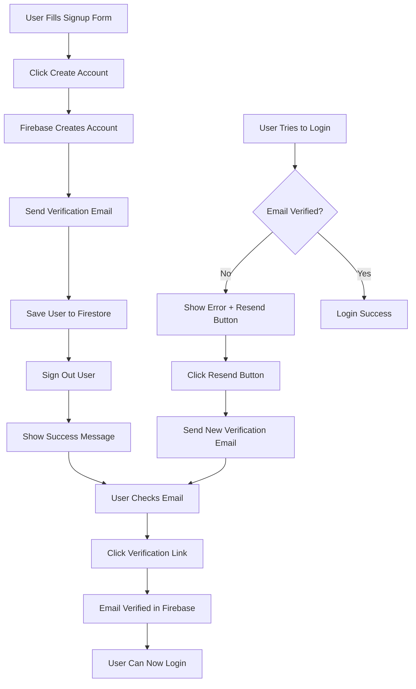

# Email Verification Feature Documentation

## Overview
This document describes the email verification feature that has been added to prevent fake or inactive email addresses from accessing the Majayjay Farm Resource Management System.

## 🎯 Purpose
- **Prevent fake accounts**: Ensures users provide valid, active email addresses
- **Improve security**: Verifies user identity before granting system access
- **Reduce spam**: Blocks automated bot registrations
- **Ensure deliverability**: Confirms users can receive important system notifications

## ✨ Features Implemented

### 1. Email Verification on Signup
When a new farmer creates an account:
1. Account is created in Firebase Authentication
2. **Verification email is sent automatically** to the provided email address
3. User profile is stored in Firestore with `emailVerified: false` flag
4. User is **signed out immediately** to prevent auto-login
5. Success message is displayed with instructions

### 2. Email Verification Check on Login
When a user attempts to login:
1. Credentials are validated
2. **Email verification status is checked**
3. If email is NOT verified:
   - User is prevented from logging in
   - Error message is displayed with instructions
   - "Resend Verification Email" button appears
4. If email IS verified:
   - User can login normally

### 3. Resend Verification Email
If a user didn't receive the verification email:
1. Enter email and password in login form
2. Click "Resend Verification Email" button
3. System checks if email is already verified
4. Sends a new verification email if needed
5. Success/error message is displayed

## 🔧 Technical Implementation

### Modified Files
- **`Login.tsx`** - Main authentication component

### Code Changes

#### 1. Added Firebase Import
```typescript
import { sendEmailVerification } from "firebase/auth";
```

#### 2. Added Success Message State
```typescript
const [successMessage, setSuccessMessage] = useState("");
```

#### 3. Updated Signup Function
```typescript
const handleSignUp = async () => {
  // ... validation ...

  // Create user account
  const userCredential = await createUserWithEmailAndPassword(...);

  // ⭐ Send verification email
  await sendEmailVerification(userCredential.user);

  // Store user data with emailVerified flag
  await setDoc(doc(db, "farmers", userCredential.user.uid), {
    // ... other fields ...
    emailVerified: false
  });

  // ⭐ Sign out to prevent auto-login
  await auth.signOut();

  // Show success message
  setSuccessMessage("Check your email to verify your account...");
};
```

#### 4. Updated Login Function
```typescript
const handleLogin = async () => {
  // ... authenticate user ...

  // ⭐ Check if email is verified
  if (!userCredential.user.emailVerified) {
    setError("Please verify your email before logging in...");
    await auth.signOut();
    return;
  }

  // Continue with normal login flow
};
```

#### 5. Added Resend Verification Function
```typescript
const handleResendVerification = async () => {
  // Sign in temporarily
  const userCredential = await signInWithEmailAndPassword(...);

  // Check if already verified
  if (userCredential.user.emailVerified) {
    setSuccessMessage("Email already verified!");
    return;
  }

  // Resend verification email
  await sendEmailVerification(userCredential.user);
  await auth.signOut();

  setSuccessMessage("Verification email sent!");
};
```

#### 6. Updated UI Components
```tsx
{/* Success message display */}
{successMessage && (
  <div className="p-3 bg-success/10 border border-success/20 rounded-md">
    <CheckCircle className="h-4 w-4 text-success" />
    <p className="text-sm text-success">{successMessage}</p>
  </div>
)}

{/* Resend verification button (shown only when needed) */}
{error && error.includes("verify your email") && (
  <Button onClick={handleResendVerification}>
    Resend Verification Email
  </Button>
)}
```

## 📧 Email Verification Flow



## 🎨 UI/UX Changes

### Success Message (Green Alert)
```
┌─────────────────────────────────────────────────────────┐
│ ✓ Account created successfully! Please check your      │
│   email (user@example.com) to verify your account      │
│   before logging in. Check your spam folder if you     │
│   don't see the email.                                  │
└─────────────────────────────────────────────────────────┘
```

### Error Message (Red Alert)
```
┌─────────────────────────────────────────────────────────┐
│ ⚠ Please verify your email before logging in. Check    │
│   your inbox for the verification link. Didn't receive │
│   the email? Click 'Resend Verification Email' below.  │
└─────────────────────────────────────────────────────────┘
```

### Resend Verification Button
```
┌─────────────────────────────────────────────────────────┐
│                                                          │
│              [   Resend Verification Email   ]           │
│                                                          │
└─────────────────────────────────────────────────────────┘
```

## 🔒 Security Benefits

### Before Email Verification
❌ Anyone could create accounts with fake emails
❌ Bots could spam registrations
❌ No way to contact users for important updates
❌ Users could lose access if email is wrong

### After Email Verification
✅ Only valid email addresses can access the system
✅ Bots are blocked (can't access email inboxes)
✅ Confirmed communication channel with users
✅ Users verify their email is correct during signup

## 📱 User Experience Flow

### New User Signup
1. User fills out signup form
2. Clicks "Create Account"
3. Sees green success message
4. Checks email inbox (or spam folder)
5. Clicks verification link in email
6. Returns to login page
7. Logs in successfully

### User Didn't Receive Email
1. User tries to login
2. Sees error about email verification
3. Clicks "Resend Verification Email"
4. Receives new verification email
5. Clicks link in email
6. Returns to login successfully

### Already Verified User
1. User creates account
2. Verifies email
3. Logs in normally (no extra steps)

## 🧪 Testing Scenarios

### Test Case 1: Normal Signup Flow
1. ✅ Fill signup form with valid data
2. ✅ Click "Create Account"
3. ✅ See success message
4. ✅ Check email inbox
5. ✅ Click verification link
6. ✅ Login successfully

### Test Case 2: Login Without Verification
1. ✅ Create account
2. ✅ Try to login immediately (before verifying)
3. ✅ See error message
4. ✅ See "Resend Verification Email" button
5. ❌ Cannot access dashboard

### Test Case 3: Resend Verification
1. ✅ Create account
2. ✅ Try to login (see error)
3. ✅ Click "Resend Verification Email"
4. ✅ See success message
5. ✅ Receive new email
6. ✅ Verify and login

### Test Case 4: Already Verified
1. ✅ Create and verify account
2. ✅ Try to resend verification
3. ✅ See "already verified" message

### Test Case 5: Google Sign-In
1. ✅ Sign in with Google
2. ✅ Google accounts are pre-verified
3. ✅ No email verification needed
4. ✅ Access dashboard immediately

## ⚙️ Configuration

### Firebase Email Verification Settings
The verification email is sent by Firebase with default settings:
- **From**: `noreply@majayjay-farm.firebaseapp.com`
- **Subject**: "Verify your email for Majayjay Farm"
- **Contains**: Link to verify email

### Customizing Email Template (Optional)
To customize the verification email:
1. Go to Firebase Console
2. Navigate to Authentication → Templates
3. Select "Email Address Verification"
4. Customize template text and styling
5. Save changes

## 🔍 Troubleshooting

### Issue: User doesn't receive verification email
**Solutions**:
1. Check spam/junk folder
2. Wait a few minutes (emails can be delayed)
3. Click "Resend Verification Email"
4. Verify email address is typed correctly
5. Check email provider isn't blocking Firebase emails

### Issue: Verification link doesn't work
**Solutions**:
1. Make sure user clicks the latest verification email
2. Link expires after some time - resend new email
3. Check browser isn't blocking the redirect
4. Clear browser cache and try again

### Issue: Still can't login after verifying
**Solutions**:
1. Refresh the login page
2. Wait a few seconds for Firebase to update
3. Try logging out and back in
4. Contact admin if problem persists

### Issue: "Too many requests" error
**Solution**:
- Firebase limits email sends to prevent abuse
- Wait 5-10 minutes before requesting another email
- This is a security feature

## 📊 Database Schema Update

### Firestore `farmers` Collection
Added new field:
```typescript
{
  uid: string;
  email: string;
  fullName: string;
  farmName: string;
  role: string;
  createdAt: string;
  emailVerified: boolean; // ⭐ NEW FIELD
  photoURL?: string | null;
}
```

**Note**: This field is informational. The actual verification status is stored in Firebase Auth `user.emailVerified`.

## 🚀 Deployment Notes

### Required Firebase Configuration
1. Email verification is enabled by default in Firebase Auth
2. No additional Firebase configuration needed
3. Verification emails are sent automatically by Firebase

### Production Considerations
1. **Custom Domain**: Configure Firebase to send from your domain
2. **Email Templates**: Customize to match your brand
3. **Rate Limiting**: Firebase handles this automatically
4. **Monitoring**: Check Firebase Console for email delivery stats

## 📈 Benefits Summary

| Benefit | Description |
|---------|-------------|
| **Security** | Only verified users can access the system |
| **Data Quality** | Ensures valid email addresses in database |
| **User Trust** | Professional verification process |
| **Communication** | Confirmed ability to reach users |
| **Spam Prevention** | Blocks automated bot registrations |
| **Account Recovery** | Valid email needed for password resets |

## 🎯 Best Practices Implemented

✅ **Clear Instructions**: Users know exactly what to do
✅ **Error Handling**: Proper error messages for all scenarios
✅ **Resend Option**: Easy way to get a new verification email
✅ **Visual Feedback**: Success/error messages clearly displayed
✅ **Form Clearing**: Signup form clears after successful submission
✅ **Prevent Auto-Login**: User must verify before accessing system
✅ **Spam Folder Warning**: Reminds users to check spam
✅ **Already Verified Check**: Handles edge cases gracefully

## 🔐 Security Considerations

### What's Protected
- User accounts require valid email verification
- Prevents mass fake account creation
- Ensures communication channel is valid

### What's NOT Protected (Additional Security Needed)
- Brute force login attempts (consider rate limiting)
- Password strength (already has 6-char minimum)
- Account takeover (consider 2FA for future)

## 📝 Future Enhancements (Optional)

1. **Custom Email Templates**: Brand the verification emails
2. **SMS Verification**: Add phone number verification
3. **Two-Factor Authentication**: Extra security layer
4. **Email Change Verification**: Verify when user changes email
5. **Verification Reminders**: Send reminder if not verified after 24h
6. **Admin Dashboard**: Show verification status for all users
7. **Analytics**: Track verification completion rates

## 📞 User Support

### Common User Questions

**Q: I didn't receive the verification email**
A: Check your spam folder, wait a few minutes, or click "Resend Verification Email"

**Q: Can I use the system without verifying?**
A: No, email verification is required for all farmers. Admins don't need verification.

**Q: How long do I have to verify my email?**
A: The verification link doesn't expire, but it's recommended to verify within 24 hours.

**Q: Can I change my email after signing up?**
A: Currently no. Contact admin if you need to change your registered email.

**Q: I verified but still can't login**
A: Refresh the page and try again. If problem persists, contact support.

---

## Summary

The email verification feature successfully:
- ✅ Prevents fake email addresses
- ✅ Improves system security
- ✅ Ensures valid communication channels
- ✅ Provides clear user feedback
- ✅ Handles edge cases gracefully
- ✅ Integrates seamlessly with existing UI
- ✅ Maintains consistent UX patterns

**Status**: ✅ Complete and Ready for Production
