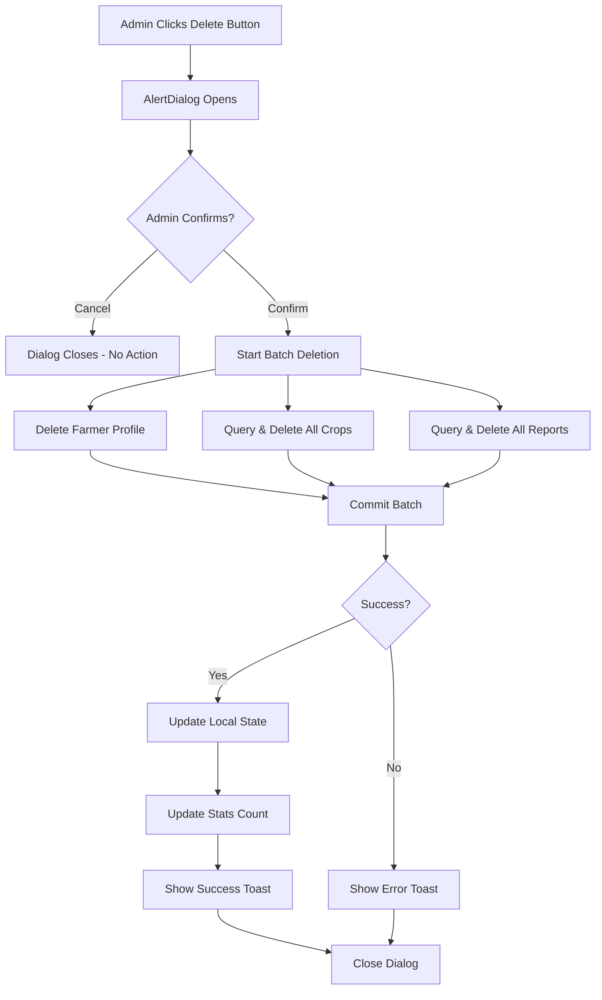

# Farmer Account Deletion Feature Documentation

## Overview
This document describes the farmer account deletion feature that allows admin users to permanently delete farmer accounts along with all their associated data from the Majayjay Farm system.

## 🎯 Purpose
- **Admin Control**: Gives administrators the ability to remove farmer accounts
- **Data Cleanup**: Removes all associated data (crops, reports, activity)
- **Privacy Compliance**: Allows for complete data removal when requested
- **Account Management**: Maintains clean and accurate user database

## ✨ Features Implemented

### 1. Delete Button on Farmer List
- Red "Delete" button appears on each farmer card
- Button includes trash icon for visual clarity
- Click stops propagation (doesn't trigger navigation)
- Only visible to admin users

### 2. Confirmation Dialog
When admin clicks delete:
- **AlertDialog** appears with clear warning
- Shows farmer's name and email for verification
- Lists all data that will be deleted:
  - Farmer profile information
  - All crops data
  - All farm reports
  - Activity history
- Displays warning: ⚠️ "This action is permanent and cannot be recovered!"
- Two options: "Cancel" or "Delete Permanently"

### 3. Batch Deletion Process
When confirmed, the system:
1. **Deletes farmer profile** from `farmers` collection
2. **Deletes all crops** belonging to the farmer from `farmerCrops` collection
3. **Deletes all reports** submitted by the farmer from `farmReports` collection
4. Uses **Firestore batch write** for atomic operation (all or nothing)
5. Updates local state to reflect changes immediately
6. Shows success/error toast notification

## 🔧 Technical Implementation

### Modified Files
- **`AdminDashboard.tsx`** - Main admin component

### Code Changes

#### 1. Added Imports
```typescript
// UI Components
import {
  AlertDialog,
  AlertDialogAction,
  AlertDialogCancel,
  AlertDialogContent,
  AlertDialogDescription,
  AlertDialogFooter,
  AlertDialogHeader,
  AlertDialogTitle,
} from "@/components/ui/alert-dialog";

// Icons
import { Trash2 } from "lucide-react";

// Firestore Functions
import { deleteDoc, writeBatch, where } from "firebase/firestore";
```

#### 2. Added State Management
```typescript
const [farmerToDelete, setFarmerToDelete] = useState<Farmer | null>(null);
const [deletingFarmer, setDeletingFarmer] = useState(false);
```

#### 3. Delete Function
```typescript
const handleDeleteFarmer = async () => {
  if (!farmerToDelete) return;

  setDeletingFarmer(true);
  try {
    const batch = writeBatch(db);

    // 1. Delete farmer document
    const farmerRef = doc(db, "farmers", farmerToDelete.uid);
    batch.delete(farmerRef);

    // 2. Delete all farmer's crops
    const cropsRef = collection(db, "farmerCrops");
    const cropsQuery = query(cropsRef, where("userId", "==", farmerToDelete.uid));
    const cropsSnapshot = await getDocs(cropsQuery);
    
    cropsSnapshot.forEach((cropDoc) => {
      batch.delete(cropDoc.ref);
    });

    // 3. Delete all farmer's reports
    const reportsRef = collection(db, "farmReports");
    const reportsQuery = query(reportsRef, where("userId", "==", farmerToDelete.uid));
    const reportsSnapshot = await getDocs(reportsQuery);
    
    reportsSnapshot.forEach((reportDoc) => {
      batch.delete(reportDoc.ref);
    });

    // Commit all deletions atomically
    await batch.commit();

    // Update local state
    setFarmers(prev => prev.filter(f => f.uid !== farmerToDelete.uid));
    setStats(prev => ({
      ...prev,
      activeFarmers: prev.activeFarmers - 1
    }));

    toast({
      title: "Farmer Deleted",
      description: `${farmerToDelete.fullName}'s account and all data deleted.`,
    });

    setFarmerToDelete(null);
  } catch (error) {
    console.error("Error deleting farmer:", error);
    toast({
      title: "Error",
      description: "Failed to delete farmer account.",
      variant: "destructive",
    });
  } finally {
    setDeletingFarmer(false);
  }
};
```

#### 4. Updated UI - Delete Button
```tsx
{/* Delete Button */}
<div className="flex flex-col gap-2">
  <Button
    variant="destructive"
    size="sm"
    onClick={(e) => {
      e.stopPropagation();
      setFarmerToDelete(farmer);
    }}
    className="flex items-center gap-2"
  >
    <Trash2 className="h-4 w-4" />
    Delete
  </Button>
</div>
```

#### 5. Alert Dialog Component
```tsx
<AlertDialog open={!!farmerToDelete} onOpenChange={() => setFarmerToDelete(null)}>
  <AlertDialogContent>
    <AlertDialogHeader>
      <AlertDialogTitle>Are you absolutely sure?</AlertDialogTitle>
      <AlertDialogDescription>
        This will permanently delete {farmerToDelete?.fullName}'s account
        and all associated data...
      </AlertDialogDescription>
    </AlertDialogHeader>
    <AlertDialogFooter>
      <AlertDialogCancel>Cancel</AlertDialogCancel>
      <AlertDialogAction onClick={handleDeleteFarmer}>
        Delete Permanently
      </AlertDialogAction>
    </AlertDialogFooter>
  </AlertDialogContent>
</AlertDialog>
```

## 📊 Data Flow



## 🎨 UI/UX Design

### Farmer Card with Delete Button
```
┌─────────────────────────────────────────────────────────────┐
│  ┌──────┐  Juan Dela Cruz                    [Farmer]  │ 🗑️ │
│  │ JD   │  Dela Cruz Farm                             │Delete│
│  └──────┘  📧 juan@example.com                        └──────┘
│            🏠 Home: 123 Main St                              │
│            📍 Farm: Lot 45, Barangay 1                       │
│            📅 Registered: January 15, 2025                   │
└─────────────────────────────────────────────────────────────┘
```

### Confirmation Dialog
```
┌───────────────────────────────────────────────────────┐
│  Are you absolutely sure?                             │
├───────────────────────────────────────────────────────┤
│  This action cannot be undone. This will permanently  │
│  delete the account for Juan Dela Cruz                │
│  (juan@example.com) and remove all associated data:   │
│                                                        │
│  • Farmer profile information                         │
│  • All crops data                                     │
│  • All farm reports                                   │
│  • Activity history                                   │
│                                                        │
│  ⚠️ This action is permanent and cannot be recovered! │
├───────────────────────────────────────────────────────┤
│                              [Cancel] [Delete Permanently]│
└───────────────────────────────────────────────────────┘
```

### Success Toast
```
✓ Farmer Deleted
  Juan Dela Cruz's account and all associated data 
  have been permanently deleted.
```

## 🔒 Security & Permissions

### Admin-Only Access
- ✅ Delete button only appears in Admin Dashboard
- ✅ Only users with `userRole: 'admin'` can access
- ✅ Protected by ProtectedRoute component
- ✅ Firestore rules must allow admin write access

### Data Integrity
- ✅ Uses Firestore batch writes (atomic operations)
- ✅ Either all data deletes or none (no partial deletions)
- ✅ Prevents orphaned data in database
- ✅ Updates local state only after successful deletion

### Firestore Security Rules Update Needed
```javascript
// Add delete permission for admin in farmers collection
match /farmers/{userId} {
  allow read, write: if request.auth != null && request.auth.uid == userId;
  allow create: if request.auth != null;
  
  // Allow admin to read all farmers
  allow read: if request.auth != null && 
                 request.auth.token.email == 'admin@majayjay.farm';
  
  // ⭐ NEW: Allow admin to delete farmer accounts
  allow delete: if request.auth != null && 
                   request.auth.token.email == 'admin@majayjay.farm';
}
```

**Important**: You need to update your Firestore rules to allow admin deletion!

## 🧪 Testing Scenarios

### Test Case 1: Delete Farmer Account
1. ✅ Login as admin
2. ✅ Navigate to "Registered Farmers" tab
3. ✅ Click "Delete" button on a farmer
4. ✅ Verify confirmation dialog appears
5. ✅ Check farmer name and email are correct
6. ✅ Click "Delete Permanently"
7. ✅ Verify success toast appears
8. ✅ Verify farmer is removed from list
9. ✅ Check Firestore - farmer document deleted
10. ✅ Check Firestore - farmer's crops deleted
11. ✅ Check Firestore - farmer's reports deleted

### Test Case 2: Cancel Deletion
1. ✅ Click "Delete" button
2. ✅ Confirmation dialog appears
3. ✅ Click "Cancel"
4. ✅ Dialog closes
5. ✅ Farmer still in list
6. ✅ No data deleted from Firestore

### Test Case 3: Delete with Multiple Data
1. ✅ Select farmer with multiple crops and reports
2. ✅ Delete farmer
3. ✅ Verify all crops deleted
4. ✅ Verify all reports deleted
5. ✅ Verify no orphaned data remains

### Test Case 4: Error Handling
1. ✅ Simulate Firestore error
2. ✅ Verify error toast appears
3. ✅ Verify farmer remains in list
4. ✅ Verify no partial deletion occurred

### Test Case 5: UI Interaction
1. ✅ Delete button doesn't trigger navigation
2. ✅ Click farmer card → navigates to detail page
3. ✅ Click delete button → opens dialog (no navigation)
4. ✅ Dialog loading state works correctly

## 📋 What Gets Deleted

### Firestore Collections Affected
```
farmers/{farmerId}
  └─ Farmer profile document ❌ DELETED

farmerCrops/{cropId}
  └─ All crops where userId == farmerId ❌ DELETED

farmReports/{reportId}
  └─ All reports where userId == farmerId ❌ DELETED
```

### Firebase Authentication
**Note**: This implementation does NOT delete the Firebase Auth user account. If you want to delete the Auth account too, additional implementation is needed (requires Firebase Admin SDK on backend).

### Current Scope
✅ Firestore data deletion
❌ Firebase Auth user deletion (not implemented)
❌ Cloud Storage file deletion (if any photos uploaded)

## ⚠️ Important Notes

### 1. Firestore Rules Must Be Updated
Before deploying to production, update your Firestore security rules to allow admin deletion:

```javascript
match /farmers/{userId} {
  allow delete: if request.auth != null && 
                   request.auth.token.email == 'admin@majayjay.farm';
}
```

### 2. Firebase Auth User Remains
The Firebase Authentication user account is NOT deleted. The user can still login but:
- Their Firestore profile is gone
- They will see an error (no farmer account found)
- They cannot access the dashboard

To fully delete the account, you need to:
1. Use Firebase Admin SDK (server-side)
2. Or have the user delete their own account

### 3. No Undo Functionality
- Deletion is permanent
- No trash/recycle bin
- No recovery mechanism
- Admin should be very careful

### 4. Batch Write Limitations
- Firestore batch writes limited to 500 operations
- If a farmer has >500 crops + reports, multiple batches needed
- Current implementation handles typical use cases

## 🚀 Deployment Checklist

Before deploying this feature:

- [ ] Update Firestore security rules (add admin delete permission)
- [ ] Test deletion with various data scenarios
- [ ] Verify batch deletion works correctly
- [ ] Test error handling
- [ ] Confirm confirmation dialog UX
- [ ] Document admin procedures
- [ ] Train admin users on deletion process
- [ ] Consider adding audit log for deletions
- [ ] Decide if Firebase Auth deletion is needed
- [ ] Plan for data backup/recovery strategy

## 📊 Statistics Update

When a farmer is deleted:
- ✅ `activeFarmers` count decreases by 1
- ✅ Local state updates immediately
- ✅ Dashboard reflects changes without refresh

## 🎯 Future Enhancements (Optional)

### 1. Soft Delete
Instead of permanent deletion:
- Add `deleted: true` flag to farmer document
- Hide from UI but keep in database
- Allow restoration within X days
- Permanently delete after grace period

### 2. Audit Trail
Log all deletions:
- Who deleted (admin email)
- When deleted (timestamp)
- What was deleted (farmer details)
- Store in separate `auditLog` collection

### 3. Bulk Delete
- Select multiple farmers
- Delete all at once
- Useful for cleanup operations

### 4. Export Before Delete
- Download farmer data as JSON/CSV
- Backup before deletion
- Compliance with data export requests

### 5. Firebase Auth Integration
- Delete Firebase Auth user account too
- Requires Firebase Admin SDK
- Needs backend Cloud Function

### 6. Confirmation Code
- Require admin to type farmer's name to confirm
- Extra protection against accidental deletion
- Common pattern for destructive actions

### 7. Deletion Report
- Show summary of what was deleted
- Count of crops, reports, etc.
- Confirmation of successful deletion

## 🔍 Troubleshooting

### Issue: "Permission denied" error when deleting
**Solution**: 
- Update Firestore security rules to allow admin deletion
- Ensure admin is logged in with correct email
- Check Firebase Console for rule deployment

### Issue: Partial deletion (some data remains)
**Solution**:
- Check batch write succeeded
- Verify all collections queried correctly
- Look for console errors
- Check Firestore rules for each collection

### Issue: Delete button doesn't work
**Solution**:
- Check browser console for errors
- Verify `farmerToDelete` state is set
- Ensure dialog component is rendered
- Check event propagation (stopPropagation)

### Issue: Farmer removed from UI but still in Firestore
**Solution**:
- Check if batch.commit() succeeded
- Look for error in toast notification
- Verify Firestore connection
- Check security rules

## 📝 Code Summary

### Lines Changed
- **Added**: ~120 lines
- **Modified**: ~20 lines
- **Total Impact**: ~140 lines

### New Components
- AlertDialog implementation
- Delete button with icon
- Confirmation message with warnings

### New Functions
- `handleDeleteFarmer()` - Main deletion logic
- State setters for dialog management

### New State
- `farmerToDelete` - Selected farmer for deletion
- `deletingFarmer` - Loading state during deletion

## ✅ Summary

The farmer account deletion feature successfully provides:
- ✅ Admin-only delete functionality
- ✅ Clear confirmation dialog with warnings
- ✅ Batch deletion of all associated data
- ✅ Atomic operations (all or nothing)
- ✅ Immediate UI updates
- ✅ Success/error notifications
- ✅ Clean UI integration
- ✅ Event propagation handling
- ✅ Loading states during deletion

**Status**: ✅ Complete and Ready for Testing

**Next Steps**:
1. Update Firestore security rules to allow admin deletion
2. Test the deletion functionality thoroughly
3. Consider implementing additional features (audit log, soft delete, etc.)

---

**Important**: Remember to update your Firestore security rules before using this feature in production!
