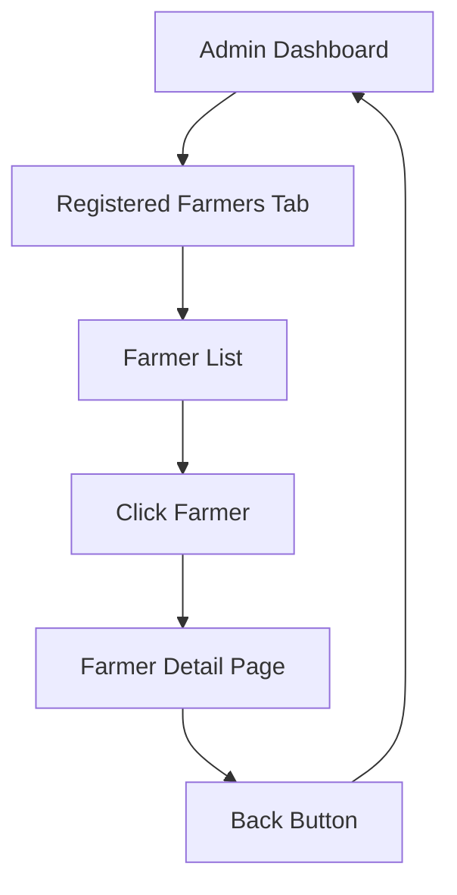

# Registered Farmers Feature Documentation

## Overview
This document describes the new "Registered Farmers" feature added to the Admin Dashboard. This feature allows administrators to view all registered farmers, their profile information, and navigate to detailed farmer pages to view their crop information.

## Features Implemented

### 1. Registered Farmers Tab
- **Location**: Admin Dashboard → First tab (left of Analytics)
- **Access**: Admin users only
- **Purpose**: Display a list of all farmers registered in the system

### 2. Farmer List View
Each farmer item displays:
- **Circular Profile Image**: Shows farmer's profile photo or initials
- **Full Name**: Primary identifier
- **Farm Name**: Secondary identifier
- **Email**: Contact information
- **Home Address**: If provided by the farmer
- **Farm Address**: If provided by the farmer
- **Registration Date**: When the farmer joined the system

### 3. Farmer Detail Page
When clicking on a farmer from the list, admins are navigated to a dedicated page showing:

#### Profile Section
- Large circular profile image
- Full name and farm name
- Email address
- Registration date
- Home address
- Farm address
- Total farm land area (calculated from all crops)

#### Crop Statistics
- **Total Crops**: Count of all crops
- **In Progress**: Crops currently growing
- **Harvested**: Successfully harvested crops

#### In Progress Crops Section
Displays crops currently being cultivated with:
- Crop name
- Planted date
- Land area (hectares)
- Quantity (kg)
- Soil type
- Investment (₱)
- NPK values (Nitrogen, Phosphorus, Potassium)
- Status badge: "In Progress"

#### Harvested Crops Section
Displays completed crops with:
- Same details as in-progress crops
- Status badge: "Harvested"
- Slightly faded appearance to differentiate from active crops

## File Structure

### New Files Created
1. **FarmerDetailPage.tsx** (`src/pages/FarmerDetailPage.tsx`)
   - Individual farmer profile and crop details page
   - 490 lines of code
   - Full TypeScript implementation

### Modified Files
1. **AdminDashboard.tsx** (`src/pages/AdminDashboard.tsx`)
   - Added Farmer interface
   - Added farmers state management
   - Added loadFarmers() function
   - Added helper functions (getInitials, formatDate)
   - Updated TabsList from 3 to 4 columns
   - Added "Registered Farmers" tab content
   - Added necessary imports (Avatar, Mail, Home icons)

2. **App.tsx** (`src/App.tsx`)
   - Added FarmerDetailPage import
   - Added route: `/admin/farmer/:farmerId`
   - Protected with admin-only access

## Data Flow

### Farmer Data Structure
```typescript
interface Farmer {
  uid: string;              // Unique user ID
  email: string;            // Email address
  fullName: string;         // Full name
  farmName: string;         // Farm name
  role: string;             // User role (farmer)
  createdAt: string;        // Registration timestamp
  photoURL?: string | null; // Profile photo URL
  homeAddress?: string;     // Home address (optional)
  farmAddress?: string;     // Farm address (optional)
}
```

### Crop Status Determination
Crops are automatically categorized as:
- **In Progress**: Planted less than 90 days ago
- **Harvested**: Planted more than 90 days ago

This logic can be customized per crop type in future updates.

## Firestore Collections Used

### 1. `farmers` Collection
- Read by admin to display farmer list
- Contains farmer profile information
- Security: Admin has read access

### 2. `farmerCrops` Collection
- Filtered by userId to show farmer's crops
- Contains crop details (name, area, quantity, NPK, etc.)
- Security: Admin can read all crops (as per security rules)

## UI/UX Design Patterns

### Consistent with Existing Design
- Uses same color scheme and theme
- Matches Analytics, Reports, and Location Map tabs
- Consistent card shadows and borders
- Same hover effects and transitions
- Matching badge styles
- Uniform spacing and typography

### Interactive Elements
- **Farmer List Items**: Hover effect + cursor pointer
- **Profile Images**: Circular avatars with fallback initials
- **Back Button**: Returns to admin dashboard
- **Tab Navigation**: Smooth content switching without page reload

### Responsive Design
- Grid layouts adapt to screen size
- Mobile-friendly list and detail views
- Proper text truncation for long content

## Navigation Flow



## Usage Instructions

### For Administrators

1. **Viewing Registered Farmers**
   - Log in as admin (admin@majayjay.farm)
   - Navigate to Admin Dashboard
   - Click "Registered Farmers" tab (first tab)
   - View list of all registered farmers

2. **Viewing Farmer Details**
   - Click on any farmer from the list
   - View comprehensive profile information
   - See all crops categorized by status
   - Click "Back to Admin Dashboard" to return

3. **Understanding Crop Data**
   - **In Progress**: Currently growing crops
   - **Harvested**: Completed crops
   - NPK values show soil nutrient levels
   - Investment shows capital invested (₱)

## Security & Permissions

### Admin-Only Access
- Only users with `userRole: 'admin'` can access
- Protected by ProtectedRoute component
- Redirects non-admin users to home page

### Firestore Security Rules Compliance
The feature respects existing security rules:
```javascript
// Farmers collection - admins can read all
match /farmers/{userId} {
  allow read, write: if request.auth != null && request.auth.uid == userId;
  allow create: if request.auth != null;
}

// Farmer Crops - admin can read all
match /farmerCrops/{cropId} {
  allow read: if request.auth != null && 
                 request.auth.token.email == 'admin@majayjay.farm';
}
```

## Testing Checklist

### Functional Testing
- [ ] Admin can view Registered Farmers tab
- [ ] Farmer list displays all registered farmers
- [ ] Profile images load correctly
- [ ] Initials fallback works when no photo
- [ ] Email, addresses display correctly
- [ ] Registration dates format properly
- [ ] Click on farmer navigates to detail page
- [ ] Farmer detail page loads all information
- [ ] Crops are categorized correctly (In Progress/Harvested)
- [ ] Back button returns to admin dashboard
- [ ] Non-admin users cannot access feature

### UI/UX Testing
- [ ] Tab navigation is smooth
- [ ] No page reloads when switching tabs
- [ ] Hover effects work on farmer list items
- [ ] Responsive design works on mobile
- [ ] Loading states display properly
- [ ] Empty states show when no data
- [ ] Error messages display on failures

## Future Enhancements

### Potential Features
1. **Search & Filter**
   - Search farmers by name or email
   - Filter by registration date
   - Sort by various criteria

2. **Farmer Statistics**
   - Total harvest yield
   - Average investment
   - Success rate metrics

3. **Export Functionality**
   - Export farmer list to CSV
   - Generate farmer reports

4. **Address Management**
   - Allow farmers to update addresses
   - Geocoding for map display

5. **Crop Status Management**
   - Custom status categories
   - Manual status updates
   - Harvest date tracking

6. **Communication Tools**
   - Send notifications to farmers
   - Messaging system
   - Bulk email functionality

## Troubleshooting

### Issue: Farmers not loading
**Solution**: 
- Check Firestore security rules
- Verify admin authentication
- Check browser console for errors

### Issue: Profile images not displaying
**Solution**:
- Check photoURL field in farmer document
- Verify image URLs are accessible
- Fallback initials should still display

### Issue: Crops not showing
**Solution**:
- Verify farmerCrops collection has userId field
- Check Firestore security rules for admin access
- Ensure crops are properly linked to farmer

### Issue: Navigation not working
**Solution**:
- Verify route is registered in App.tsx
- Check farmerId parameter is passed correctly
- Ensure ProtectedRoute allows admin access

## Performance Considerations

### Optimization Strategies
1. **Data Loading**
   - Farmers loaded once on dashboard mount
   - Crops loaded per farmer on detail page
   - Sorted in-memory to avoid complex queries

2. **Render Performance**
   - Uses React keys for list items
   - Conditional rendering for empty states
   - Lazy loading could be added for large datasets

3. **Network Efficiency**
   - Single query per collection
   - No unnecessary re-fetching
   - Could add caching for repeated visits

## Code Quality

### TypeScript Implementation
- Full type safety with interfaces
- No `any` types used
- Proper error handling

### React Best Practices
- Functional components with hooks
- Proper state management
- useEffect cleanup where needed
- Memoization opportunities for future optimization

### Accessibility
- Semantic HTML structure
- Proper heading hierarchy
- Keyboard navigation support
- Screen reader friendly

## Summary

The Registered Farmers feature successfully enhances the Admin Dashboard with:
- ✅ New tab in the navigation
- ✅ List view of all registered farmers
- ✅ Detailed farmer profile pages
- ✅ Crop information categorized by status
- ✅ Consistent UI/UX with existing design
- ✅ Smooth navigation without page reloads
- ✅ Full TypeScript implementation
- ✅ Firestore security compliance
- ✅ Mobile-responsive design

This feature provides administrators with comprehensive oversight of all farmers in the system, enabling better support and resource management.
