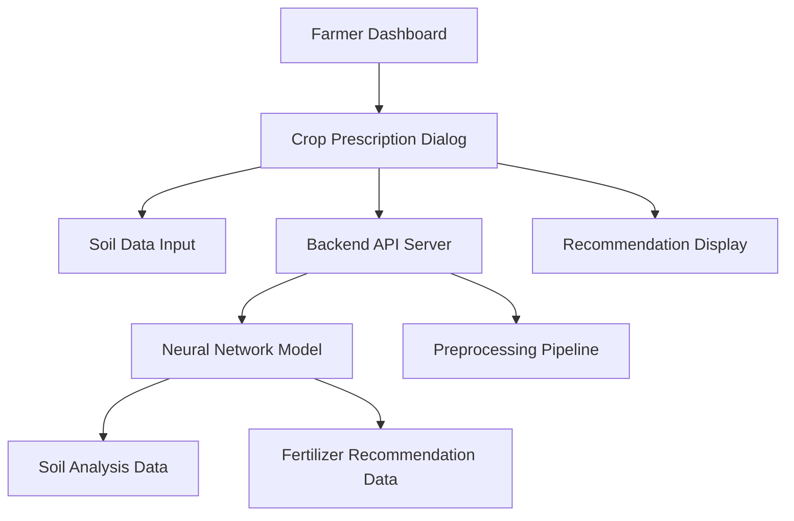
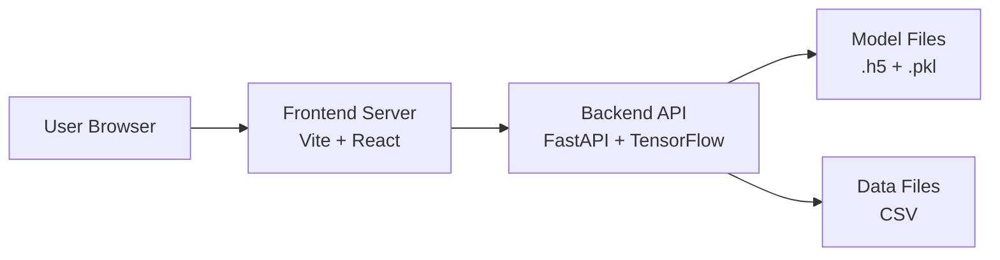

# Soil Crop Recommendation System Architecture

## Overview
This document describes the architecture of the soil-based crop recommendation system that integrates with the Majayjay Farm Resource Management System.

## System Components



## Component Details

### 1. Frontend (React + TypeScript)
- **Location**: `Frontend/` directory
- **Framework**: React with TypeScript
- **UI Library**: shadcn/ui components
- **Main Component**: `CropPrescriptionDialog.tsx`
- **Function**: User interface for soil data input and crop recommendations display

### 2. Backend API Server (FastAPI)
- **File**: `fert_soil_transformer.py`
- **Framework**: FastAPI with Uvicorn
- **Function**: 
  - Serve crop recommendations via REST API
  - Load and run the trained neural network model
  - Preprocess incoming soil data
  - Return JSON-formatted recommendations

### 3. Neural Network Model
- **File**: `fert_soil_transformer.h5` (generated after training)
- **Type**: Dense neural network (simplified from original Transformer architecture)
- **Input Features**: 
  - pH level (numerical)
  - Nitrogen level (categorical: L, M, H)
  - Phosphorus level (categorical: L, M, H)
  - Potassium level (categorical: L, M, H)
- **Output**: Probability distribution over crop types

### 4. Data Sources
- **Soil Analysis Data**: `Backend/Data/Soilanaly.csv`
  - Contains real soil samples from Majayjay, Laguna
  - Features: pH, Nitrogen, Phosphorus, Potassium levels
  - Target: Currently planted crops

- **Fertilizer Recommendations**: `Backend/Data/FertilizerRecomm.csv`
  - Contains standardized fertilizer recommendations for various crops
  - Used for training context and future enhancements

### 5. Preprocessing Pipeline
- **File**: `preprocessing_pipeline.pkl` (generated after training)
- **Function**: 
  - Standardize numerical features (pH)
  - Encode categorical features (N, P, K levels)
  - Transform crop names to numerical labels
  - Reverse transformations for output

## Data Flow

### Training Phase
1. Load `Soilanaly.csv` and `FertilizerRecomm.csv`
2. Preprocess data (clean, encode, normalize)
3. Train neural network model on soil features → crop labels
4. Save trained model as `fert_soil_transformer.h5`
5. Save preprocessing pipeline as `preprocessing_pipeline.pkl`

### Inference Phase (API Request)
1. User inputs soil data in Crop Prescription Dialog
2. Frontend sends POST request to `/recommend` endpoint
3. Backend loads model and preprocessing pipeline
4. Backend preprocesses input data
5. Model predicts crop probabilities
6. Backend postprocesses predictions (convert labels to crop names)
7. Backend returns JSON response with recommendations
8. Frontend displays recommendations to user

## API Endpoints

### GET /
- **Description**: Health check endpoint
- **Response**: 
```json
{
  "message": "Soil Crop Recommendation API",
  "description": "POST /recommend to get crop recommendations based on soil data"
}
```

### POST /recommend
- **Description**: Get crop recommendations based on soil data
- **Request Body**:
```json
{
  "pH": 6.5,
  "Nitrogen": "M",
  "Phosphorus": "L",
  "Potassium": "H"
}
```
- **Response**:
```json
{
  "recommended_crops": [
    {
      "crop": "Rice",
      "confidence": 0.85
    },
    {
      "crop": "Corn",
      "confidence": 0.12
    },
    {
      "crop": "Vegetable Legumes",
      "confidence": 0.03
    }
  ]
}
```

### GET /health
- **Description**: Health status check
- **Response**:
```json
{
  "status": "healthy",
  "model_loaded": true
}
```

## Deployment Architecture



## Security Considerations

1. **CORS Configuration**: Properly configured to allow frontend requests
2. **Input Validation**: API validates all incoming data
3. **Error Handling**: Graceful error responses without exposing internals
4. **No Authentication**: Currently open for demonstration (add authentication in production)

## Scalability Considerations

1. **Model Loading**: Model loaded once at startup, not per request
2. **Stateless API**: Each request is independent
3. **Caching**: Results could be cached for identical inputs
4. **Horizontal Scaling**: Multiple backend instances can run behind load balancer

## Future Enhancements

1. **Model Improvements**: 
   - Use actual Transformer architecture for better performance
   - Add more features (weather, season, etc.)
   - Implement ensemble methods

2. **Data Enhancements**:
   - Integrate real-time weather data
   - Add historical yield data
   - Include market price information

3. **API Enhancements**:
   - Add authentication and user sessions
   - Implement rate limiting
   - Add detailed crop information (planting guide, care instructions)

4. **Frontend Enhancements**:
   - Interactive soil analysis visualization
   - Comparison of multiple soil samples
   - Integration with farm management features